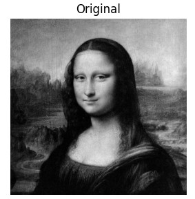
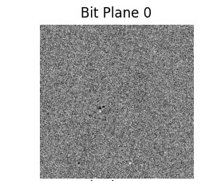
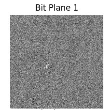
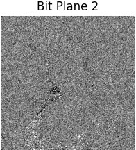
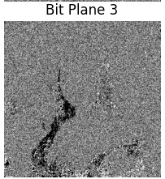
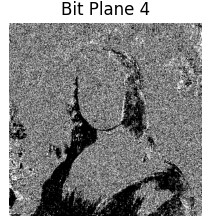
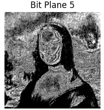
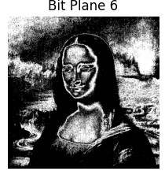
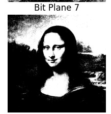

# Bit Plane Slicing

## Implementation

The Python program used for Bit Plane Slicing is:

[bitplaneslicing.py](./bitplaneslicing.py)

## Results

### Original Image and Bit Planes

<table>

<tr>
<td></td>
<td></td>
<td></td>
</tr>

<tr>
<td></td>
<td></td>
<td></td>
</tr>

<tr>
<td></td>
<td></td>
<td></td>
</tr>

</table>

